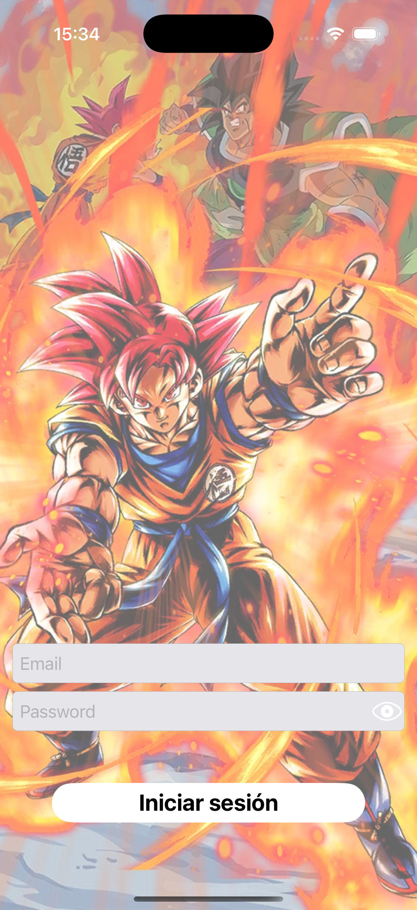
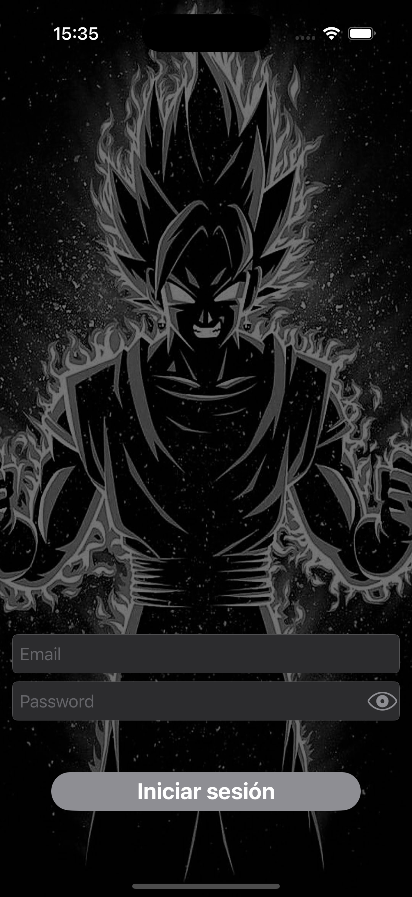
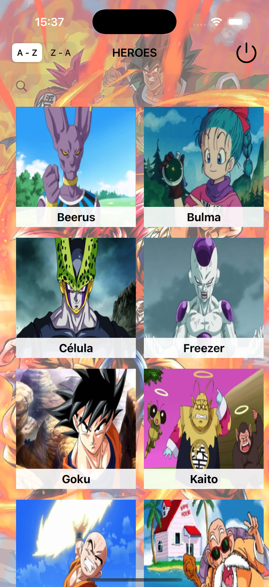
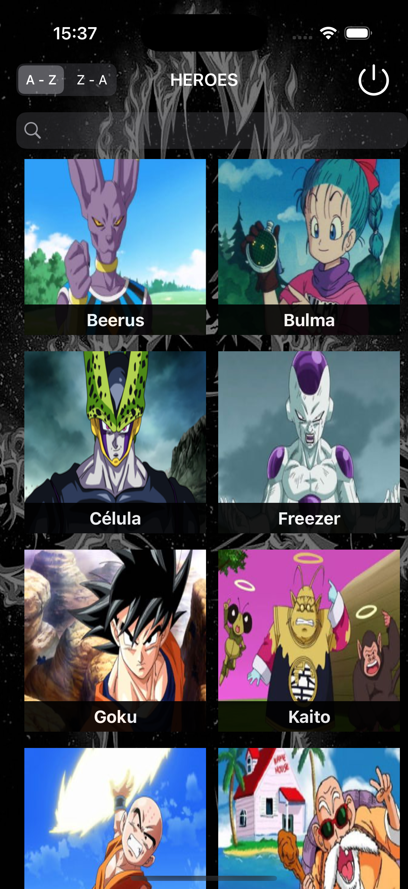
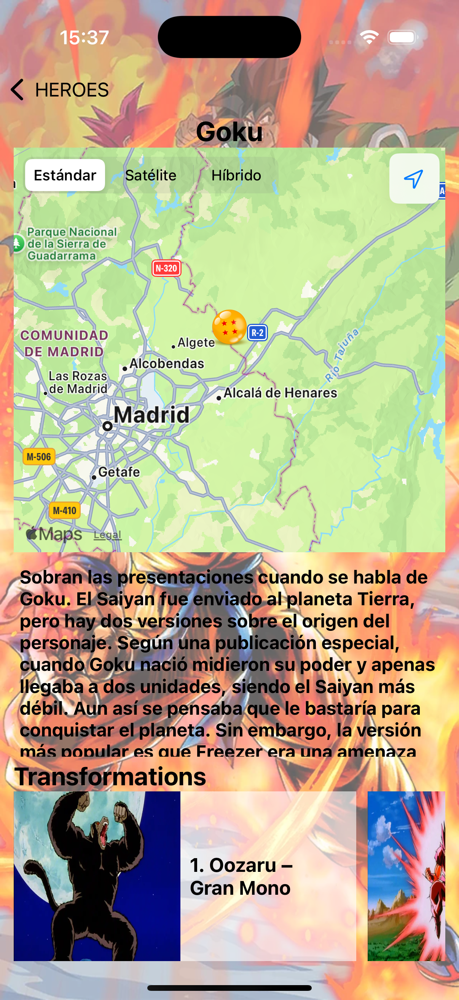
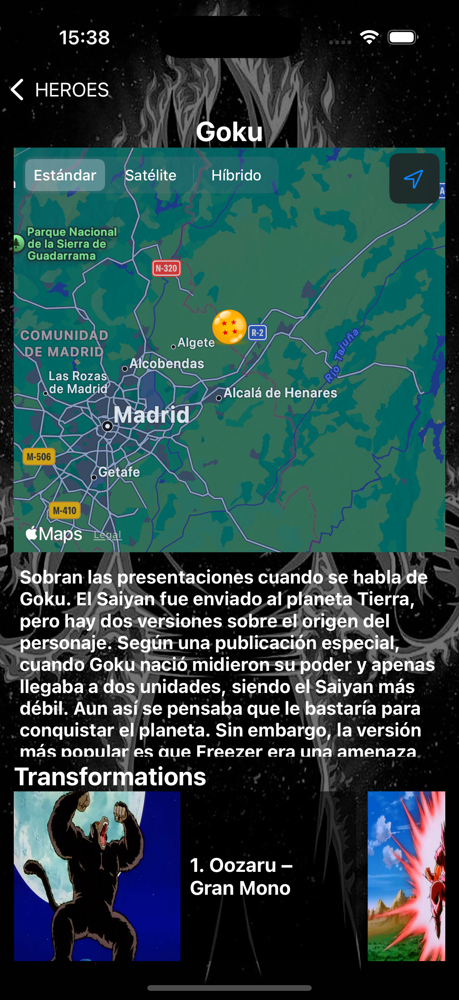
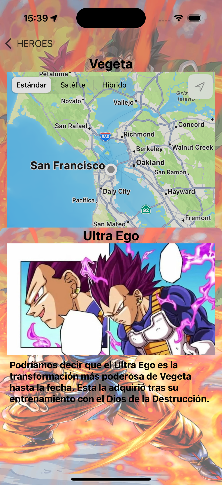
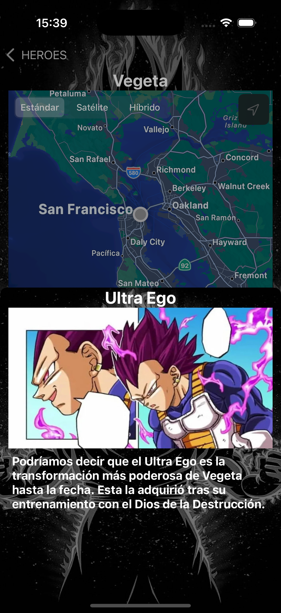

# DragonBall iOS Avanzado

¡Bienvenido a la app DragonBall iOS Avanzado!
Esta aplicación es un proyecto avanzado de iOS que muestra héroes, localizaciones y transformaciones del universo Dragon Ball, utilizando arquitectura limpia, Core Data, consumo de APIs y buenas prácticas de desarrollo.

---

## 🚀 Características

- **Pantalla de Splash** animada.
- **Login seguro** con almacenamiento en Keychain.
- **Listado de héroes** con imágenes y detalles.
- **Detalle de héroe** con transformaciones y localizaciones.
- **Mapa interactivo** con las ubicaciones de los héroes.
- **Persistencia local** con Core Data.
- **Arquitectura limpia** (MVVM, separación de capas).
- **Soporte para modo oscuro y colores personalizados.**

---

## 🛠️ Tecnologías utilizadas

- Swift 5
- UIKit
- Core Data
- MapKit
- KeychainSwift
- Xcode 15+

---

## 📲 Instalación

1. Clona este repositorio en tu máquina local.
2. Abre el archivo `DragonBall_iOS_Avanzado.xcodeproj` con Xcode.
3. Selecciona un simulador de iPhone y pulsa **Run** (o `⌘+R`).
4. En el login de la aplicación introduce tu usuario y contraseña válidos para la API de Dragon Ball.

> **Nota:** Si no dispones de usuario para la API, puedes iniciar sesión con:
> - **Usuario:** manololiebana@gmail.com
> - **Contraseña:** abcdef

## 🔑 Permisos necesarios

La app solicita acceso a la ubicación para mostrar los héroes en el mapa.
Asegúrate de aceptar los permisos cuando se soliciten.

---

## 📦 Estructura del proyecto

- `/Data`: Lógica de acceso a datos (Core Data, red, Keychain).
- `/Domain`: Modelos de dominio.
- `/Presentation`: Vistas y ViewModels.
- `/Assets.xcassets`: Imágenes y colores.
- `/Tests`: Pruebas unitarias y de integración.

---

## 📱 Capturas de pantalla - Modo claro y oscuro.

### 1. Login
- Modo claro: 
  
- Modo oscuro: 
  

### 2. Lista de héroes
- Modo claro: 
  
- Modo oscuro: 
  

### 3. Detalle del héroe y transformación
- Modo claro: 
  
- Modo oscuro: 
  

### 4. Detalle de transformación
- Modo claro: 
  
- Modo oscuro: 
  

---

## 👨‍💻 Autor

- Manuel Liebana

---

## 📄 Licencia

Este proyecto es solo para fines educativos. 